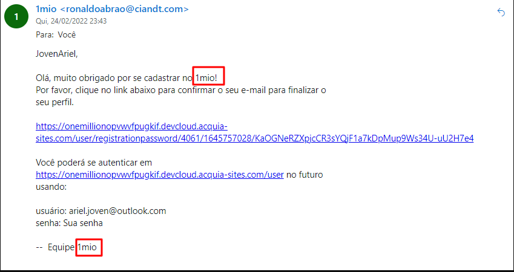
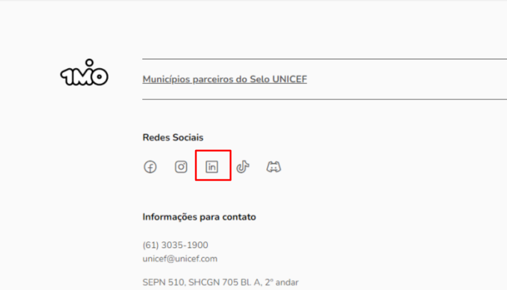

## **Ações realizadas:**

### Município do Selo
> ✅ Cadastrar Município, publicar vaga e curso. 
> ✅ TA de RH, também postar no Feed.

### Município Fora do Selo
> ✅ Cadastrar Município real, publicar vaga e curso. 
> ✅ TA de RH, também postar no Feed.

### Perfil de empresa
> ✅ Empresa real, cadastrar empresa, publicar vaga e curso. 
> ✅ TA de RH, também postar no Feed.

### Perfil de Jovem
> ✅ Comentar em post, preencher perfil, dar like nas vagas.

### Geral
> ✅ Testar vagas em lote. 
> ✅ Perfil de consultoria, ação aprova os fluxos.

 
 

**Feedback geral de usabilidade da nova Plataforma do 1 Milhão de Oportunidades:**

> ### **Guia de navegação por prioridade**
>* [Prioridade Alta](https://thiagowilliamp.github.io/feedback-plataforma-1mio/#munic%C3%ADpio-do-selo-1) 
>* [Prioridade Média](https://thiagowilliamp.github.io/feedback-plataforma-1mio/#munic%C3%ADpio-do-selo-1) 
>* [Prioridade Baixa](https://thiagowilliamp.github.io/feedback-plataforma-1mio/#munic%C3%ADpio-do-selo-1) 

**Feedback geral de usabilidade da nova Plataforma do 1 Milhão de Oportunidades:**

# **Prioridade Alta** 

 

- ## Município do Selo
- ## Município fora do Selo
- ## Perfil Empresa
- ## Perfil Joven
- ## Geral
> ### Para todos os perfís, o email só é recebido em email da Microsoft, e estão caindo em Spam.(Acredito que com a migração isso será resolvido, mas incluí aqui no feedback)
> 

 

>- ### 1MiO está escrito em letras minúsculas nos emails recebidos
> 

 

>- ### No rodapé, o link que leva para ao LinkedIn está incorreto, deve ser substituído por esse `https://www.linkedin.com/company/1mio`
> 

# **Prioridade Média** 

 

- ## Município do Selo
- ## Município fora do Selo
- ## Perfil Empresa
- ## Perfil Joven
- ## Geral

# **Prioridade Baixa** 

 

- ## Município do Selo
- ## Município fora do Selo
- ## Perfil Empresa
- ## Perfil Joven
- ## Geral

