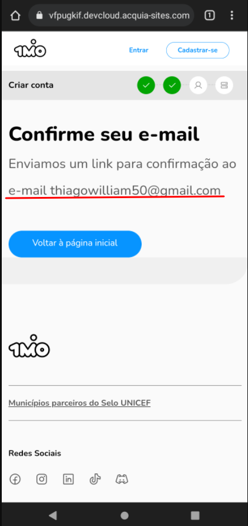

## **Ações realizadas:**

### Município do Selo
> ✅ Cadastrar Município, publicar vaga e curso. 
> ✅ TA de RH, também postar no Feed.

### Município Fora do Selo
> ✅ Cadastrar Município real, publicar vaga e curso. 
> ✅ TA de RH, também postar no Feed.

### Perfil de empresa
> ✅ Empresa real, cadastrar empresa, publicar vaga e curso. 
> ✅ TA de RH, também postar no Feed.

### Perfil de Jovem
> ✅ Comentar em post, preencher perfil, dar like nas vagas.

### Geral
> ✅ Testar vagas em lote. 
> ✅ Perfil de consultoria, ação aprova os fluxos.

 
 

**Feedback geral de usabilidade da nova Plataforma do 1 Milhão de Oportunidades:**

> ### **Guia de navegação por prioridade**
>* [Prioridade Alta](#prioridade-alta) 
>* [Prioridade Média](#prioridade-média) 
>* [Prioridade Baixa](#prioridade-baixa) 

**Feedback geral de usabilidade da nova Plataforma do 1 Milhão de Oportunidades:**

# **Prioridade Alta** 

 

- ## Município do Selo
> `Nenhum feedback de melhoria até o momento.`
- ## Município fora do Selo
> ### 1MiO está escrito com a letra "`O`" em letra minúscula na tela de explicação do Termo de compromisso.
> 

 

- ## Perfil Empresa 
> `Nenhum feedback de melhoria até o momento.`
- ## Perfil Joven 
> ### No momento do cadastro das redes-socias no perfil do joven, se possível, colocar uma validação para não permitir o `@`  no inicio do nome de usuário, pois o link fica "Quebrado".
> 

 

> ### No momento do cadastro das redes-socias no perfil do joven, quando é adicionado um link diferente do formato permitido aparece uma crítica em inglês, acho que ficaria melhor se pudesse vir traduzida.
> 

 

> ### Se possível colocar ao lado do botão "Refaser Teste" um botão para ir para o feed pois no momento que o joven acaba de preencher as habilidades 1MiO, fica um  pouco confuso de o que deve ser feito.
> 

 

## Geral
> - ### Para todos os perfís, o email só é recebido em email da Microsoft, e estão caindo em Spam.(Acredito que com a migração isso será resolvido, mas incluí aqui no feedback).
> 

 

>- ### 1MiO está escrito em letras minúsculas nos emails recebidos.
> 

 

>- ### No rodapé, o link que leva para ao LinkedIn está incorreto, deve ser substituído por esse `https://www.linkedin.com/company/1mio`
> 

# **Prioridade Média** 

 

- ## Município do Selo
> `Nenhum feedback de melhoria até o momento.`
- ## Município fora do Selo
> `Nenhum feedback de melhoria até o momento.`
- ## Perfil Empresa
> `Nenhum feedback de melhoria até o momento.`
- ## Perfil Joven
> `Nenhum feedback de melhoria até o momento.`
- ## Geral
> `Nenhum feedback de melhoria até o momento.`

# **Prioridade Baixa** 

 

- ## Município do Selo
> `Nenhum feedback de melhoria até o momento.`
- ## Município fora do Selo
> `Nenhum feedback de melhoria até o momento.`
- ## Perfil Empresa
> `Nenhum feedback de melhoria até o momento.`
- ## Perfil Joven
> `Nenhum feedback de melhoria até o momento.`
- ## Geral

 
 
 
 
 
 

- #### _[Veja no GitHub.](https://github.com/thiagowilliamp/feedback-plataforma-1mio)_
- #### _[Veja no Google Planilhas.](#)_
- #### _[veja em PDF.](#)_

